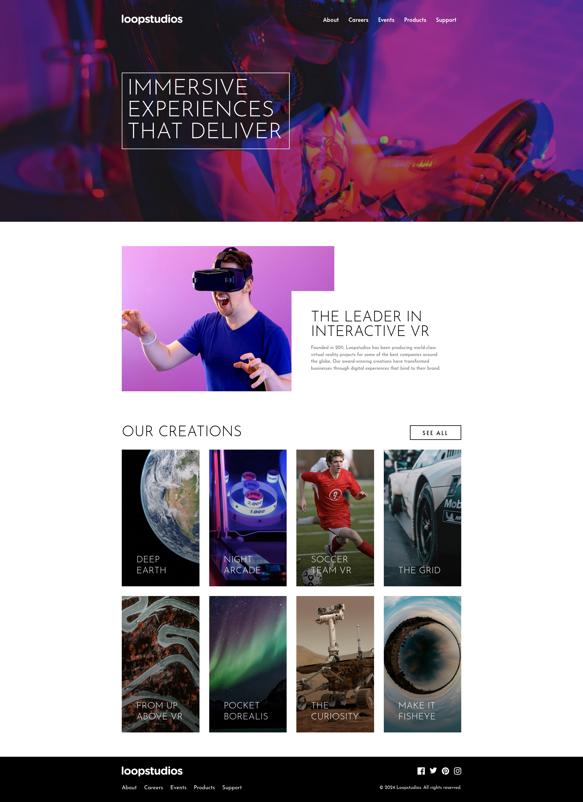

# Frontend Mentor - Loopstudios landing page solution

This is a solution to the <a target="_blank" href="https://www.frontendmentor.io/challenges/loopstudios-landing-page-N88J5Onjw"> Loopstudios landing page challenge on Frontend Mentor</a> Frontend Mentor challenges help you improve your coding skills by building realistic projects.

## Table of contents

- [Overview](#overview)
  - [The challenge](#the-challenge)
  - [Links](#links)
- [My process](#my-process)
  - [Built with](#built-with)
- [Author](#author)

**Note: Delete this note and update the table of contents based on what sections you keep.**

## Overview

### The challenge

Users should be able to:

- View the optimal layout for the site depending on their device's screen size
- See hover states for all interactive elements on the page

### Links

- Live Site URL: <a target="_blank" href="https://loopstudios-landing-page-pearl-rho.vercel.app/">https://loopstudios-landing-page-pearl-rho.vercel.app/</a>

## My process

### Built with

- Semantic HTML5 markup
- CSS custom properties
- Flexbox
- CSS Grid
- Mobile-first workflow
- <a target="_blank" href="https://astro.build/">Astro</a> - Framework
- <a target="_blank" href="https://tailwindcss.com/">Tailwind</a> - For styles

## Author

<!-- - Website - [Add your name here](https://www.your-site.com) -->

- Frontend Mentor - <a target="_blank" href="https://www.frontendmentor.io/profile/Nombiembre">@Nombiembre</a>
